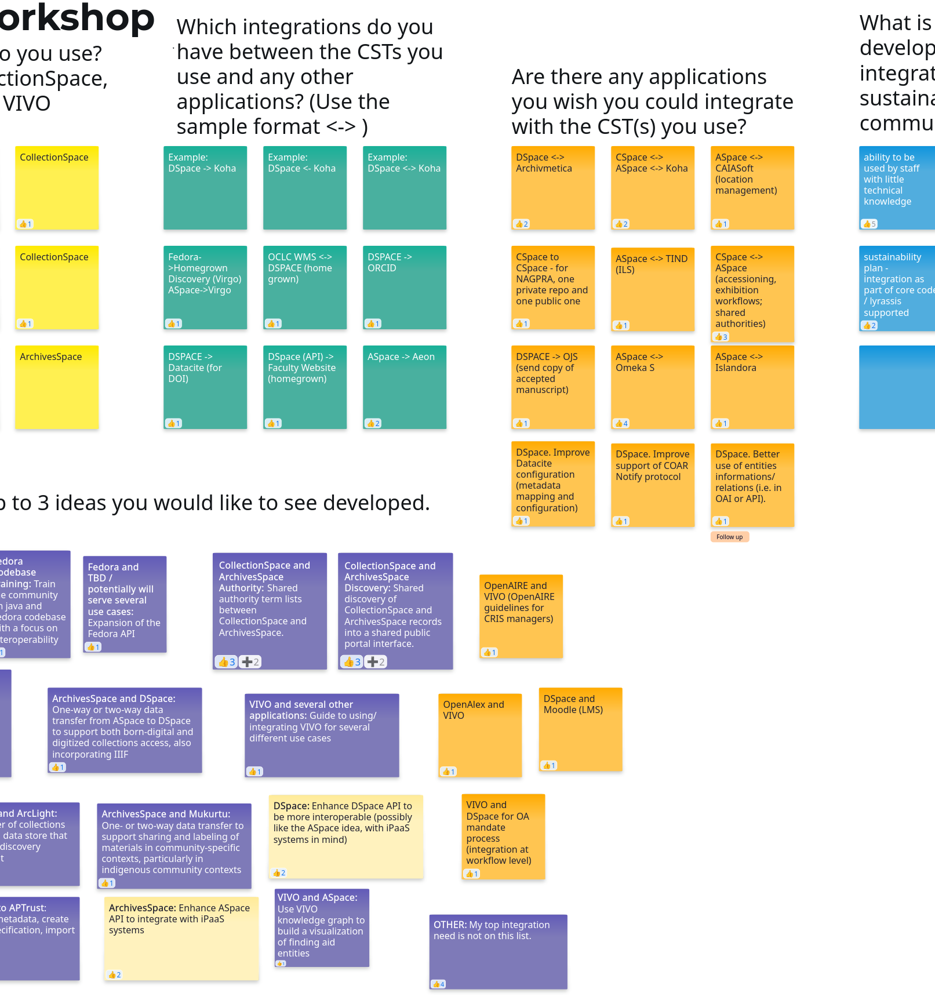

# Lyrasis CST Interoperability Project
The Community Supported Technologies (CST) Interoperability Project will enhance interoperability of each of the  CSTs in the Lyrasis Organizational Home: ArchivesSpace, CollectionSpace, DSpace, Fedora and VIVO. 

# Project Updates

## Use Cases Selected
*March 6, 2026*

We recently celebrated a project milestone! In February, the Interoperability project team received approval to write specifications for several use cases:

| **ID** | **User Story**  | **CST Application(s)**  | **Specifications Focus** |
| ------ |---------------- | ----------------------- | ------------------------ |
| A1, A2 | As an ArchivesSpace User, when I am editing a component in ArchivesSpace, I want to search for an item or a collection of related items in DSpace and add their link(s) to corresponding ArchivesSpace digital object record(s). | ArchivesSpace, DSpace                                    | ArchivesSpace use of DSpace Search API  One-time data transfer (no automatic synchronization) |
| A3, A4 | As an ArchivesSpace User, I want to deposit a file or folder of files into an institutional repository, digital library, or preservation system and link to it in a new ArchivesSpace digital object record(s).                  | ArchivesSpace, DSpace                                    | ArchivesSpace use of SWORD API for deposits                                                         |
| V1     | As a VIVO user, when I add a publication to my VIVO profile I want to deposit the publication in my institutional repository and link to it from my VIVO profile.                                                                | VIVO, DSpace                                             | VIVO use of SWORD API for deposits                                                                  |
| V2     | As a VIVO user, I want to receive updates on my VIVO profile when there are status or metadata changes to a linked publication in my institutional repository.                                                                   | VIVO, DSpace                                             | VIVO support for COAR-notify messages                                                               |
| C1     | As an administrator of CollectionSpace I would like to make my CollectionSpace records and digital content available to my institution’s OAI-PMH compliant discovery system.                                                     | CollectionSpace                                          | OAI-PMH API for CollectionSpace                                                                     |
| C2     | As an administrator of both ArchivesSpace and CollectionSpace, I want to offer a single search interface for data from both so that users can search for more historical collections in one place.                               | CollectionSpace, ArchiveSpace                            | OAI-PMH API for CollectionSpace                                                                     |
| C3     | As a user of a shared discovery platform containing records from both CollectionSpace and ArchivesSpace, I want to conduct a search and bring up relevant records from each.                                                     | CollectionSpace, ArchivesSpace                           | ArchivesSpace-CollectionSpace DataMapping/Search Requirements                                       |
| F1, V1 | As a potential Fedora, VIVO, DSpace, CollectionSpace, or ArchivesSpace adopter, I want to have easy access to documentation and examples for integration so that I can more easily understand its relevance in my ecosystem.     | Fedora, VIVO, DSpace, CollectionSpace, and ArchivesSpace | Integration Repository and Documentation                                                            |
| D1     | As a lecturer, I want to deposit course materials from my Learning Management System into DSpace                                                                                                                                 | DSpace                                                   | Integration Repository and Documentation                                                            |
| D2     | As a DSpace user I would like to send an updated copy of a manuscript to OJS for Peer Review                                                                                                                                     | DSpace                                                   | Integration Repository and Documentation                                                            |

These succinct use cases synthesize feedback from surveys, workshops, and engagements with community user and technology teams. The data showed that Lyrasis CSTs already support a wide range of use cases and workflows. Within communities, there was rarely a top need that was obvious. We hope that some users find that even if a use case is not their specific case, they may be able to benefit from some of the development, because it is focused on open protocols. We intend to write specifications to create proof of concept integrations with these open protocols with a few Lyrasis CSTs: ArchivesSpace and DSpace; VIVO and DSpace; and CollectionSpace and ArchivesSpace. 

Our decisions came from much discussion about the feedback with program staff and community code contributors. We will focus the technical specifications on leveraging and improving existing CST functionality to enable integrations. Many of the ideas we *didn't* choose fall into these categories:
- The integration had already been built and documented
- The integration is already in the CST's development roadmap
- The integration does not make use of existing functionality; development scope may be too big
- The integration does not leverage open source technology

One user story, F1, is a bit different from the rest. We will write specifications for a repository that will include information on how to integrate Lyrasis CSTs with many different technologies. This is in response to several documentation and training needs voiced in the survey and workshops.

The project's final report, which will be shared publicly, will include a deeper dive into the survey and feedback data.

## Fall Feedback Sessions
*Dec. 18, 2025*

The [feedback](feedback.md) process has taken shape:

1. Generate ideas
2. Generate conversation about ideas
3. Generate solutions

### Generating Ideas
We are nearing the end of the idea generation process. The CST communities have a long history of documentation and conversations about integrations and feature requests. We first generated ideas from past documentation.

#### Workshops

Then we held a series of workshops with each CST community, and a two-day blitz of workshops that members of any Lyrasis CST community could participate in to solicit ideas.

*Above: Whiteboard sample from an integration workshop*

#### Survey
We developed and released a survey. Anyone involved in a Lyrasis CST is invited to fill out the survey. We hope the survey will generate further ideas, more information about existing integrations, and feedback on other interoperability-related program needs. **The survey is open until Jan. 15**, so fill out the one for your respective community now!:

- [ArchivesSpace](https://docs.google.com/forms/d/e/1FAIpQLSe5oZ8B-3RitDRyW_HFOcehVg2l4QqN3wCNo8bZrcijjVuqaA/viewform?usp=dialog)
- [CollectionSpace](https://docs.google.com/forms/d/e/1FAIpQLSfFr45fQ1LEirZCxvWc0ScFRw9LOsX4LEAoRgdayI4D5dYvtw/viewform?usp=dialog)
- [DSpace](https://docs.google.com/forms/d/e/1FAIpQLSf5ditujBbXJl5b0ItqJ-g0eSqzRxiEqNEuG5arl0THl5clVA/viewform?usp=dialog)
- [Fedora](https://docs.google.com/forms/d/e/1FAIpQLScG7-K0tPVhjuopezNoRakZ2cVsquvuXu357Bls_iOuHbJnfg/viewform?usp=dialog)
- [VIVO](https://docs.google.com/forms/d/e/1FAIpQLSdGSmuNqkZRqBUewvnpSHKSkCpZtW8QuyNxTZ3vbqxTciaaVw/viewform?usp=dialog)

Please help us spread the word about your community’s survey: Share it with other users of your community technology, or post it on your favorite social media platform.

### Generating Conversation about Ideas
We are now discussing high level ideas to identify discrete solutions we can design. If you are a Lyrasis CST community member, you are invited to participate in conversations about proposed solutions. You have two pathways to participate.

- [GitHub Issues](https://github.com/lyrasisorghome/InteroperabilityProject/issues)
- [Email List](https://groups.google.com/a/lyrasislists.org/g/cst-interoperability)

### Generating Designs
Once solutions are identified, we will work together to draft descriptions and user behavior scenarios using a Behavior-Driven Design (BDD) process. Again, there are two ways to participate in defining user behavior:

- [GitHub Issues](https://github.com/lyrasisorghome/InteroperabilityProject/issues)
- [Email List](https://groups.google.com/a/lyrasislists.org/g/cst-interoperability)

The ideas that make it through these steps of the feedback process will be considered for developing functional requirements. The CST Interoperability consultant will propose one solution to each community's governance team. We will select up to five solutions total (at least one for each CST) with a target decision date of January 30. 

Check the [GitHub Project](https://github.com/orgs/lyrasisorghome/projects/1) to see ideas moving through the refinement process. Stay tuned to see what amazing ideas make it to the top!

## Project Kickoff at the Organizational Home Cross-Chairs Meeting
*Oct. 21, 2025*

We were fortunate to time our project kick-off with the Fall quarterly Organizational Cross-Chairs Meeting where all the Chairs and Vice Chairs of Lyrasis CSTs get together. On Oct. 15, 2025, we shared the primary goals, deadlines, and engagement points for the Interoperability project.

The [meeting slides](https://docs.google.com/presentation/d/1-wC_FNy68yYaf2rutW2vL5U0QC7_AtRm402EiPyHyxA/edit?slide=id.g36900fdbd32_0_0#slide=id.g36900fdbd32_0_0) include a summary of this information.

### ‼️ Important Dates for CST Communities

|Date|Purpose|Request|
|----|-------|-------|
|Oct-Dec 2025|Feedback|Share integration ideas.|
|Jan. 2026|Feedback|Provide feedback on suggested integrations.|
|Feb. 2026|Approval|Approve recommended workflows.|
|May 2026|Feedback|Provide feedback on draft functional requirements.|
|June 2026|Approval|Approve functional requirements.|

### 🎯 Project Milestones
|Date|Milestone|
|----|---------|
|Dec. 30, 2025|Integrations identified and feedback requested on suggested integrations.|
|Feb. 23, 2026|Integrations selected and approved.|
|April 30, 2026|Draft Specifications complete.|
|June 30, 2026| Final Specifications and full implementation package complete.|

## Announcing the Lyrasis CST Interoperability Project
*Oct. 22, 2025*
- [Announcing the Lyrasis CST Interoperabilty Project](https://lyrasis.org/the-lyrasis-organizational-home-launches-the-cst-interoperability-project/)

## Announcing the CST Growth Fund
*Aug. 1, 2025*
- [Announcing the CST Growth Fund](https://lyrasis.org/lyrasis-is-strengthening-the-foundations-of-the-organizational-home/)

<!-- ## Commands

* `mkdocs new [dir-name]` - Create a new project.
* `mkdocs serve` - Start the live-reloading docs server.
* `mkdocs build` - Build the documentation site.
* `mkdocs -h` - Print help message and exit.

## Project layout

    mkdocs.yml    # The configuration file.
    docs/
        index.md  # The documentation homepage.
        ...       # Other markdown pages, images and other files. 

-->

