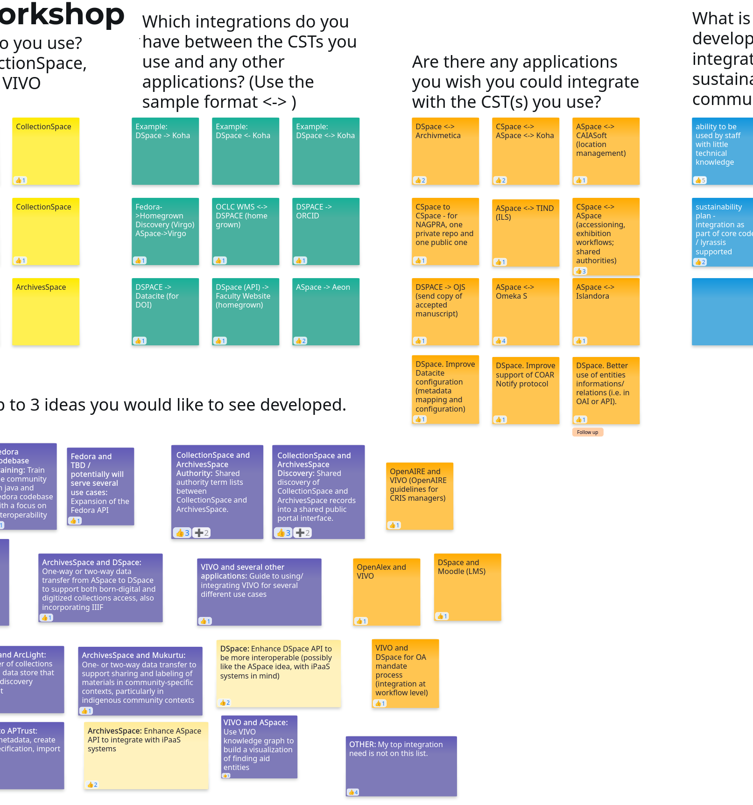

# Lyrasis CST Interoperability Project
The Community Supported Technologies (CST) Interoperability Project will enhance interoperability of each of the  CSTs in the Lyrasis Organizational Home: ArchivesSpace, CollectionSpace, DSpace, Fedora and VIVO. 

# Project Updates

## Technical Specifications Complete
*September 2, 2026*
The Lyrasis CST Interoperability Project Phase I Team is excited to share technical specifications for **six** new features for Lyrasis Community-Supported Technologies! The features are based on specific community-articulated use cases (more info on that here - link).

In May, we added Senior Software Engineer Ryan Morrison-Westphal to the team. With Ryan's expertise, we sped up the project and produced the level of detail required for developers to create the intended features.

### Feature Overviews
The project team designed six features. All 5 CSTs (ArchivesSpace, CollectionSpace, DSpace, Fedora, VIVO) are represented across the features.

The feature descriptions below are based on the design so far, not the true implementation of the products. Nothing has been built yet. The next phase of the CST Interoperability Project is to feature and product development. During the development phase, details about the functionality and user experience are subject to change. The Phase I team used technical specification documents (link) to communicate the detail and context required to design features as intended.

#### [Integration Scenario Registry](https://github.com/lyrasisorghome/InteroperabilityProject/issues/58)
*Fedora, DSpace, VIVO, CollectionSpace, and ArchivesSpace*

The Integration Scenario Registry is a new product, not a new feature or enhancement to an existing CST. It is an open hub for people working with any CST to submit information or search for information about integrations. Integrations among CSTs (e.g., Fedora <> DSpace) are accepted as well as integrations that link to technology outside of the Lyrasis CST ecosystem (e.g., Fedora <> Archive-It).

The product is specified as a read/write GitHub-native registry. Anyone with a GitHub account can submit an integration to the registry, guided by a submission form and data model. The data model requires users to include the source system, the target system, the type of integration, what protocols or standards it requires, and a description of the integration. Optional information includes links to code repositories, configuration notes, system versions, dependencies, and other information. The team suggested building a search interface that anyone with an internet connection can search without a login, and designed a moderation process.

#### [VIVO SWORD Deposit](https://github.com/lyrasisorghome/InteroperabilityProject/issues/54)
*VIVO, any SWORD server*

The VIVO SWORD Deposit feature will allow users to deposit a file to a SWORD-enabled repository (e.g., DSpace, Dataverse), such as a publication or research data set. After the file is deposited, a link to the content is written back to the user's VIVO profile.

Users may deposit a .pdf or a METS-compliant .zip file by navigating to a publication entry and selecting a new option, e.g. "SWORD Deposit." The user will be prompted to upload a file and select "Deposit." The file is deposited to the SWORD-enabled repository and a VIVO website is added to the publication. The website contains a link back to the object in its repository. 

An administrator enables and configures the SWORD endpoint through a combination of editing VIVO runtime properties and entering endpoint information in a new Site Admin > Site Configuration > SWORD Configuration GUI.

#### [ArchivesSpace SWORD Deposit](https://github.com/lyrasisorghome/InteroperabilityProject/issues/45)
*ArchivesSpace, any SWORD server*

The ArchivesSpace SWORD Deposit feature will allow users to deposit one or more files to a SWORD-enabled repository (e.g., DSpace, Dataverse), such as digitized collection material or born-digital archives. 

Users may deposit any file type that the SWORD endpoint accepts. There are three distinct user journeys (modes) specified in the feature design:
1. Users may deposit **a single file** by entering edit mode on the associated Archival Object or Resource, then Instances > Add Digital Object > Create > (new option) Upload File Version.
2. Users may deposit **many files and relate them 1:1** to an archival object by entering edit mode on the associated Archival Object or Resource, then (new option) Batch Upload and Link > Upload files.
3. Users may deposit many files and relate them all to one Archival Object or Resource by entering edit mode on the associated Archival Object or Resource, then Instances > (new button) Upload Digital Objects > Upload files.

Metadata from the Archival Object, including a link back to the digital object, is used to create the digital objects in the SWORD-enabled repository. 

After the file or group of files is deposited, ArchivesSpace digital objects for each file deposited to the endpoint are created. Each digital object contains a link to the item in the SWORD-enabled repository. 

Once published (which the repository administrator can configure to be a default mode for the feature), each new digital object will appear in the ArchivesSpace PUI linked to an Archival Object or Resource.

An administrator enables and configures the SWORD endpoint in a new GUI page similar to the existing "Manage OAI-PMH Settings" interface.

#### [ArchivesSpace <> DSpace Digital Object Linker](https://github.com/lyrasisorghome/InteroperabilityProject/issues/7)
*ArchivesSpace, DSpace*

The ArchivesSpace DSpace Digital Object Linker feature will allow users to create digital objects in ArchivesSpace from existing DSpace items, such as digitized archives or institutional archives. 

The feature then links the two records together, posting a link to the DSpace item in the ArchivesSpace Digital Object and a link to the ArchivesSpace Archival Object in the DSpace item.

The feature design recommends using existing functionality and user interfaces that will make the user journey similar to adding a digital object today. All user journeys start by entering the edit mode on the Archival Object or Resource to link, and navigating to Instances. From Instances, a user may select a new button, e.g. "Add DSpace Items." 

This will expand a list of every immediate child archival object of the host record. Each row shows the child title (or display string) and an input that can hold a provisional link to one DSpace item.

The new feature searches the DSpace API. The user can link search results in two modes:
1. Create a DO from & Link a single DSpace item to an ArchivesSpace Archival Object
2. Create DOs & Link many DSpace items to many ArchivesSpace Archival Objects

After the file or group of files is linked, ArchivesSpace digital objects for each file deposited to the endpoint are created. Each digital object contains a link to the item in the SWORD-enabled repository. 

Once published (which the repository administrator can configure to be a default mode for the feature), each new digital object will appear in the ArchivesSpace PUI linked to an Archival Object or Resource.

ArchivesSpace Digital Objects are always created anew in this feature; existing Digital Objects are *not* appended with a new File Version. An administrator enables and configures the DSpace endpoint in a new GUI menu similar to the existing "Manage OAI-PMH Settings" interface.

#### [OAI-PMH for CollectionSpace](https://github.com/lyrasisorghome/InteroperabilityProject/issues/46)
*CollectionSpace, any OAI-PMH harvester*

The OAI-PMH for CollectionSpace feature will enable the Open Archives Initiative Protocol for Metadata Harvesting. After an administrator enables the feature, harvesters will be able to collect data and digital objects from CollectionSpace collection objects that are marked as *Published To* the CollectionSpace Public Browser. An administrator enables and configures the OAI-PMH settings endpoint in a new graphical user interface (GUI).

#### [Shared Discovery for CollectionSpace and ArchivesSpace](https://github.com/lyrasisorghome/InteroperabilityProject/issues/51)

The Shared Discovery for CollectionSpace and ArchivesSpace specification describes a how a new search product could unify published CollectionSpace and ArchivesSpace records in one interface.

The design offers two display implementation options: (1) Display records from each repository side by side; or (2) display records in a unified interface. The project team recommended Display Option 1.

During the implementation phase, the implementation team will develop the search and display product, and release open source code so that other institutions may use it as a baseline for developing their own shared CollectionSpace/ArchivesSpace search.

### Technical Specification Documents
#### About the Docs
Each specification document defines actors and roles, describes integration architecture, proposes configuration details, outlines behavior and error scenarios, and includes other information for developers as required per the project's RFP.
#### Links to the Docs
1. [Integration Scenario Registry](https://github.com/lyrasisorghome/InteroperabilityProject/issues/58)
2. [VIVO SWORD Deposit](https://github.com/lyrasisorghome/InteroperabilityProject/issues/54)
3. [ArchivesSpace SWORD Deposit](https://github.com/lyrasisorghome/InteroperabilityProject/issues/45)
4. [ArchivesSpace <> DSpace Digital Object Linker](https://github.com/lyrasisorghome/InteroperabilityProject/issues/7)
5. [OAI-PMH for CollectionSpace](https://github.com/lyrasisorghome/InteroperabilityProject/issues/46)
6. [Shared Discovery for CollectionSpace and ArchivesSpace](https://github.com/lyrasisorghome/InteroperabilityProject/issues/51)

#### How to Read the Docs
If you are primarily a staff user of a Lyrasis CST, you may want to read the intro then start with the Behavior Scenarios toward the end of the doc. Developer users may find interest in more of the details between those two points.
#### How we made the Docs
From March to April 2026, the project team (Jess Farrell and Bridget Almas, with support from Community Staff teams) expanded use cases into gherkin-syntax behavior driven design scenarios. The behavior scenarios surfaced many questions about system architecture. To speed the project up, we ran the behavior scenarios through Claude to identify technical specification gaps. 

In May, Ryan Morrison-Westphal, Senior Software Engineer, joined the Redstart Works team to enhance the detail of the specification documents and fill known gaps. Ryan used his knowledge of (Ryan can you say what skills you used in your own words here?) 

After many iterations and reviews of the documents among the consultant team, the CST Director of Operations, and the CST Community Staff teams, we arrived at the documents we're sharing today. The consultant team occasionally used Claude to check for inconsistencies during revisions when, for example, a design element is changed in a 50-page specification document, and we had to find all of the places where that change would affect a feature description, diagram, behavior scenario or table data.

### What's Next
Stay tuned for updates as the CST Interoperability Project heads into Phase II, Implementation!

## Use Cases Selected
*March 6, 2026*

We recently celebrated a project milestone! In February, the Interoperability project team received approval to write specifications for several use cases:

| **ID** | **User Story**  | **CST Application(s)**  | **Specifications Focus** |
| ------ |---------------- | ----------------------- | ------------------------ |
| A1, A2 | As an ArchivesSpace User, when I am editing a component in ArchivesSpace, I want to search for an item or a collection of related items in DSpace and add their link(s) to corresponding ArchivesSpace digital object record(s). | ArchivesSpace, DSpace                                    | ArchivesSpace use of DSpace Search API  One-time data transfer (no automatic synchronization) |
| A3, A4 | As an ArchivesSpace User, I want to deposit a file or folder of files into an institutional repository, digital library, or preservation system and link to it in a new ArchivesSpace digital object record(s).                  | ArchivesSpace, DSpace                                    | ArchivesSpace use of SWORD API for deposits                                                         |
| V1     | As a VIVO user, when I add a publication to my VIVO profile I want to deposit the publication in my institutional repository and link to it from my VIVO profile.                                                                | VIVO, DSpace                                             | VIVO use of SWORD API for deposits                                                                  |
| V2     | As a VIVO user, I want to receive updates on my VIVO profile when there are status or metadata changes to a linked publication in my institutional repository.                                                                   | VIVO, DSpace                                             | VIVO support for COAR-notify messages                                                               |
| C1     | As an administrator of CollectionSpace I would like to make my CollectionSpace records and digital content available to my institution’s OAI-PMH compliant discovery system.                                                     | CollectionSpace                                          | OAI-PMH API for CollectionSpace                                                                     |
| C2     | As an administrator of both ArchivesSpace and CollectionSpace, I want to offer a single search interface for data from both so that users can search for more historical collections in one place.                               | CollectionSpace, ArchiveSpace                            | OAI-PMH API for CollectionSpace                                                                     |
| C3     | As a user of a shared discovery platform containing records from both CollectionSpace and ArchivesSpace, I want to conduct a search and bring up relevant records from each.                                                     | CollectionSpace, ArchivesSpace                           | ArchivesSpace-CollectionSpace DataMapping/Search Requirements                                       |
| F1, V1, D1, D2 | As a potential Fedora, VIVO, DSpace, CollectionSpace, or ArchivesSpace adopter, I want to have easy access to documentation and examples for integration so that I can more easily understand its relevance in my ecosystem.     | Fedora, VIVO, DSpace, CollectionSpace, and ArchivesSpace | Integration Repository and Documentation                                                            |
| D1     | As a lecturer, I want to deposit course materials from my Learning Management System into DSpace                                                                                                                                 | DSpace                                                   | Integration Repository and Documentation                                                            |
| D2     | As a DSpace user I would like to send an updated copy of a manuscript to OJS for Peer Review                                                                                                                                     | DSpace                                                   | Integration Repository and Documentation                                                            |

These succinct use cases synthesize feedback from surveys, workshops, and engagements with community user and technology teams. The data showed that Lyrasis CSTs already support a wide range of use cases and workflows. Within communities, there was rarely a top need that was obvious. We hope that some users find that even if a use case is not their specific case, they may be able to benefit from some of the development, because it is focused on open protocols. We intend to write specifications to create proof of concept integrations with these open protocols with a few Lyrasis CSTs: ArchivesSpace and DSpace; VIVO and DSpace; and CollectionSpace and ArchivesSpace. 

Our decisions came from much discussion about the feedback with program staff and community code contributors. We will focus the technical specifications on leveraging and improving existing CST functionality to enable integrations. Many of the ideas we *didn't* choose fall into these categories:
- The integration had already been built and documented
- The integration is already in the CST's development roadmap
- The integration does not make use of existing functionality; development scope may be too big
- The integration does not leverage open source technology

One user story, F1, is a bit different from the rest. We will write specifications for a repository that will include information on how to integrate Lyrasis CSTs with many different technologies. This is in response to several documentation and training needs voiced in the survey and workshops.

The project's final report, which will be shared publicly, will include a deeper dive into the survey and feedback data.

## Fall Feedback Sessions
*Dec. 18, 2025*

The [feedback](feedback.md) process has taken shape:

1. Generate ideas
2. Generate conversation about ideas
3. Generate solutions

### Generating Ideas
We are nearing the end of the idea generation process. The CST communities have a long history of documentation and conversations about integrations and feature requests. We first generated ideas from past documentation.

#### Workshops

Then we held a series of workshops with each CST community, and a two-day blitz of workshops that members of any Lyrasis CST community could participate in to solicit ideas.

*Above: Whiteboard sample from an integration workshop*

#### Survey
We developed and released a survey. Anyone involved in a Lyrasis CST is invited to fill out the survey. We hope the survey will generate further ideas, more information about existing integrations, and feedback on other interoperability-related program needs. **The survey is open until Jan. 15**, so fill out the one for your respective community now!:

- [ArchivesSpace](https://docs.google.com/forms/d/e/1FAIpQLSe5oZ8B-3RitDRyW_HFOcehVg2l4QqN3wCNo8bZrcijjVuqaA/viewform?usp=dialog)
- [CollectionSpace](https://docs.google.com/forms/d/e/1FAIpQLSfFr45fQ1LEirZCxvWc0ScFRw9LOsX4LEAoRgdayI4D5dYvtw/viewform?usp=dialog)
- [DSpace](https://docs.google.com/forms/d/e/1FAIpQLSf5ditujBbXJl5b0ItqJ-g0eSqzRxiEqNEuG5arl0THl5clVA/viewform?usp=dialog)
- [Fedora](https://docs.google.com/forms/d/e/1FAIpQLScG7-K0tPVhjuopezNoRakZ2cVsquvuXu357Bls_iOuHbJnfg/viewform?usp=dialog)
- [VIVO](https://docs.google.com/forms/d/e/1FAIpQLSdGSmuNqkZRqBUewvnpSHKSkCpZtW8QuyNxTZ3vbqxTciaaVw/viewform?usp=dialog)

Please help us spread the word about your community’s survey: Share it with other users of your community technology, or post it on your favorite social media platform.

### Generating Conversation about Ideas
We are now discussing high level ideas to identify discrete solutions we can design. If you are a Lyrasis CST community member, you are invited to participate in conversations about proposed solutions. You have two pathways to participate.

- [GitHub Issues](https://github.com/lyrasisorghome/InteroperabilityProject/issues)
- [Email List](https://groups.google.com/a/lyrasislists.org/g/cst-interoperability)

### Generating Designs
Once solutions are identified, we will work together to draft descriptions and user behavior scenarios using a Behavior-Driven Design (BDD) process. Again, there are two ways to participate in defining user behavior:

- [GitHub Issues](https://github.com/lyrasisorghome/InteroperabilityProject/issues)
- [Email List](https://groups.google.com/a/lyrasislists.org/g/cst-interoperability)

The ideas that make it through these steps of the feedback process will be considered for developing functional requirements. The CST Interoperability consultant will propose one solution to each community's governance team. We will select up to five solutions total (at least one for each CST) with a target decision date of January 30. 

Check the [GitHub Project](https://github.com/orgs/lyrasisorghome/projects/1) to see ideas moving through the refinement process. Stay tuned to see what amazing ideas make it to the top!

## Project Kickoff at the Organizational Home Cross-Chairs Meeting
*Oct. 21, 2025*

We were fortunate to time our project kick-off with the Fall quarterly Organizational Cross-Chairs Meeting where all the Chairs and Vice Chairs of Lyrasis CSTs get together. On Oct. 15, 2025, we shared the primary goals, deadlines, and engagement points for the Interoperability project.

The [meeting slides](https://docs.google.com/presentation/d/1-wC_FNy68yYaf2rutW2vL5U0QC7_AtRm402EiPyHyxA/edit?slide=id.g36900fdbd32_0_0#slide=id.g36900fdbd32_0_0) include a summary of this information.

### ‼️ Important Dates for CST Communities

|Date|Purpose|Request|
|----|-------|-------|
|Oct-Dec 2025|Feedback|Share integration ideas.|
|Jan. 2026|Feedback|Provide feedback on suggested integrations.|
|Feb. 2026|Approval|Approve recommended workflows.|
|May 2026|Feedback|Provide feedback on draft functional requirements.|
|June 2026|Approval|Approve functional requirements.|

### 🎯 Project Milestones
|Date|Milestone|
|----|---------|
|Dec. 30, 2025|Integrations identified and feedback requested on suggested integrations.|
|Feb. 23, 2026|Integrations selected and approved.|
|April 30, 2026|Draft Specifications complete.|
|June 30, 2026| Final Specifications and full implementation package complete.|

## Announcing the Lyrasis CST Interoperability Project
*Oct. 22, 2025*
- [Announcing the Lyrasis CST Interoperabilty Project](https://lyrasis.org/the-lyrasis-organizational-home-launches-the-cst-interoperability-project/)

## Announcing the CST Growth Fund
*Aug. 1, 2025*
- [Announcing the CST Growth Fund](https://lyrasis.org/lyrasis-is-strengthening-the-foundations-of-the-organizational-home/)

<!-- ## Commands

* `mkdocs new [dir-name]` - Create a new project.
* `mkdocs serve` - Start the live-reloading docs server.
* `mkdocs build` - Build the documentation site.
* `mkdocs -h` - Print help message and exit.

## Project layout

    mkdocs.yml    # The configuration file.
    docs/
        index.md  # The documentation homepage.
        ...       # Other markdown pages, images and other files. 

-->

